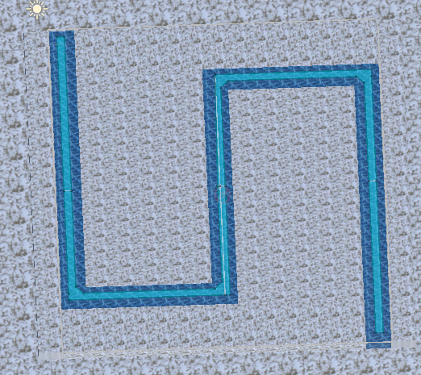

# 261001_작업일지

상태: 진행 중
담당자: 울 라
처음 작성일: 2026/10/01
막힘 여부: 없음
작업 유형: 기능
어떤 작업을 했는지 간략히 설명: 멥 생성, NavMesh 설정
최종 편집 일시: 2026년 10월 1일 오후 6:04

## 오늘 할 일

- [x]  맵 제작
- [x]  맵 내 NavMesh 구현
- [x]  MapManager.cs 구현
- [x]  Map.cs 구현
- [x]  Tile.cs 구현

## 내용

- 담당 작업

| 스크립트 | 함수 | 기능 설명 |
| --- | --- | --- |
| MapManager | `ShowBattleMap` | 전투 맵 보여주기 |
| Map | ResetMap | 스테이지 변동 시 맵 초기화 |
| Tile | `TileInstallTower` | 타일 타워 설치 |
| Tile | `TileRemovalTower` | 타일 타워 철거 |
| Tile | `ResetTile` | 타일 상태 초기화 |

## 막힌 것

- X

## 내일 할 일

- 타워 스테이터스
- 타워 병합

## 커밋 내용

- [Feat] MapManager 스크립트 추가
- [**Feat] MapManager 스크립트 수정**
- [**Feat] Map 프리팹 수정**
- [**[Feat] Map NavMesh Component 생성**](https://github.com/KimJaeSeongJade/mp15-ToyTeam-04/commit/1cd0a056263643016dd08423760d4a8b658f4e44)